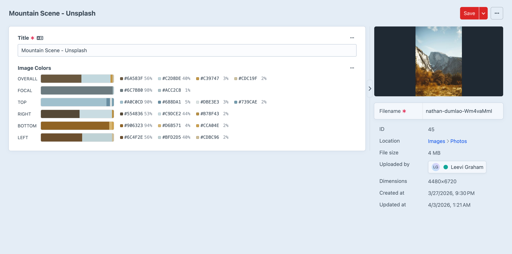
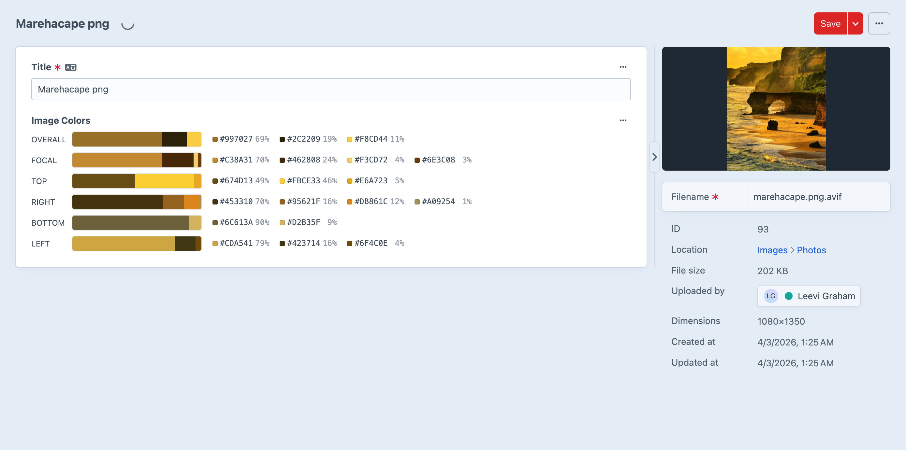
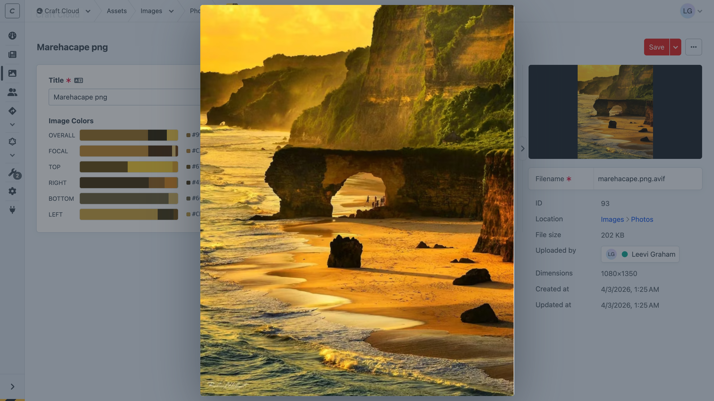
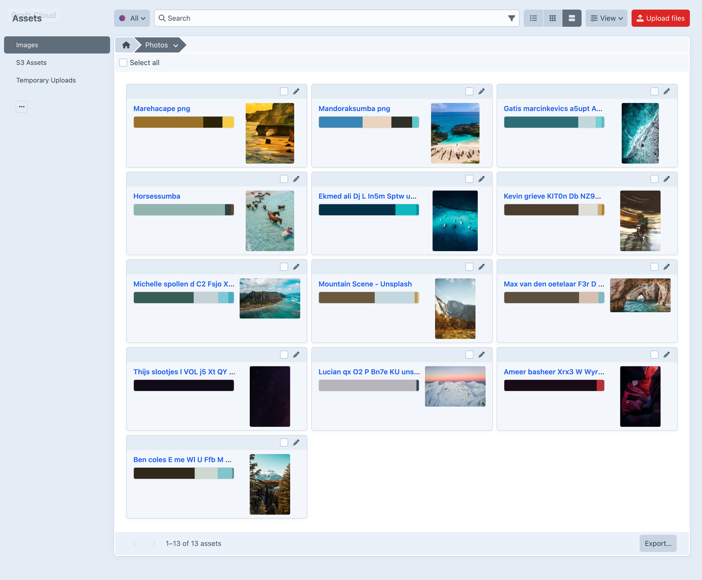

# Features

## The Image Colors Field

The Image Colors field is the heart of the plugin. It renders proportional color bars for each extraction region, showing you at a glance how dominant each color is. Below each bar, a legend displays the hex value and percentage for every extracted color.

The field is read-only — colors are extracted automatically and displayed for reference. Add it to any asset volume's field layout and the plugin takes care of the rest.

## Color Extraction

Every image is analysed across 6 regions, giving you precise control over which part of the image drives your design.

| Region | Description |
|---|---|
| `overall` | The full image |
| `focal` | A 15% region centred on the asset's focal point |
| `top` | The top 15% strip |
| `right` | The right 15% strip |
| `bottom` | The bottom 15% strip |
| `left` | The left 15% strip |

Each region produces up to 4 colors, sorted by dominance. Every color includes its **weight** — the proportion of pixels it represents — so you know exactly how dominant each color is.

## Focal Point Awareness

The focal region follows the asset's user-defined focal point. If no focal point is set, it defaults to the centre of the image.

Change the focal point and the focal region palette updates automatically — no manual re-extraction needed.

## Card and Table Previews

Color palettes also appear in asset index **card** and **table** views when you add the Image Colors field to your table columns or card properties. See your image colors at a glance without opening individual assets.

## Click to Copy

Every color swatch in the control panel — whether on the asset edit page or in index views — supports click-to-copy. Click any swatch and the hex value is copied to your clipboard with a toast notification. Handy when you're working on front-end styles and need a quick color reference.

## Weighted Colors

Unlike simple "dominant color" extractors, Image Colors gives you the full picture. Each color includes its weight as a proportion (0–1) and a rounded percentage, so you can make informed design decisions based on how much of the image each color actually represents.
