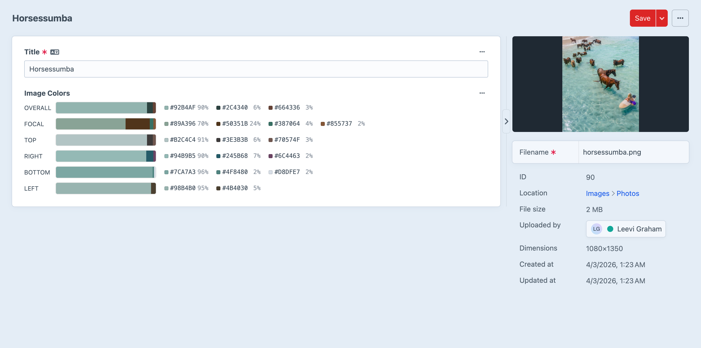
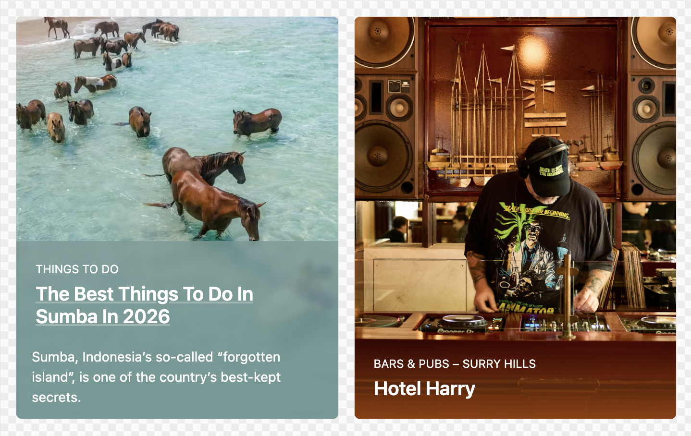

# Templating

This is where Image Colors really shines! Once your colors are extracted, you have a rich, fully-typed data model at your fingertips in Twig -- and it's an absolute joy to work with.

## Accessing Color Data

Every asset with an Image Colors field exposes a `PaletteCollection` object through the field handle you chose during [setup](./setup).


Access it in your templates like this:

```twig
{{ asset.myImageColorField }}
```

That single expression gives you access to six region palettes, each packed with up to four dominant colors, complete with hex values, RGB components, weights, and Craft's own `ColorData` utilities. Let's dig in!

## Examples

### Get the dominant color

The simplest and most common use case -- grab the single most prominent color from the full image:

```twig

<div style="background: {{ primary.hex }}">{{ primary.hex }}</div>
```

That's it! One line to get a beautiful, image-derived color onto your page.

### Loop through all colors in a region

Want to render a full palette? Loop through every extracted color in a region:

```twig


    
        {{ color.hex }} — {{ color.percentage }}%
    

```

Each region can contain up to 4 colors sorted by dominance, so you'll always get the most visually significant colors first.

### Use Craft's ColorData utilities

Here's where things get really fun. Every `Color` object exposes a `colorData` property that gives you a full instance of Craft's built-in `ColorData` model -- unlocking HSL, luma, individual RGB channels, and more:

```twig

{{ color.colorData }}                 {# #C7BA21 #}
{{ color.colorData.getHex() }}        {# #C7BA21 #}
{{ color.colorData.getRgb() }}        {# rgb(199,186,33) #}
{{ color.colorData.getHsl() }}        {# hsl(55,72%,45%) #}
{{ color.colorData.getLuma() }}        {# 0.70 #}
{{ color.colorData.getHue() }}        {# 55 #}
{{ color.colorData.getSaturation() }} {# 72 #}
{{ color.colorData.getLightness() }}  {# 45 #}
{{ color.colorData.getRed() }}        {# 199 #}
{{ color.colorData.getGreen() }}      {# 186 #}
{{ color.colorData.getBlue() }}       {# 33 #}
```

::: tip
`color.colorData` is an instance of Craft's built-in [ColorData](https://craftcms.com/docs/5.x/reference/field-types/color.html#development) model. You get the full power of Craft's color utilities without any extra work!
:::

## Usage Inspiration

This is where Image Colors gets truly exciting -- use extracted region colors to create dynamic, image-aware designs that feel effortlessly cohesive.

For example, use the **bottom** region's dominant color as a card background. Because it's sampled directly from the lower edge of the image, it naturally complements the photo and creates a seamless visual transition from image to content area.





The possibilities are endless: adaptive hero sections, dynamic text colors based on luma, gradient overlays derived from left-to-right regions, themed navigation bars using the top strip -- go wild!

## Data Model

### PaletteCollection

The top-level object returned by the field. It's a collection of `Palette` objects keyed by region name, plus optional focal point metadata.

| Property / Method | Type | Description |
|---|---|---|
| `focalPoint` | `?array` | `['x' => float, 'y' => float]` |
| `get('regionName')` | `?Palette` | Get a palette by region name |

```twig



```

#### Available Regions

Six palettes are extracted per image, each containing up to 4 colors sorted by weight:

| Region | Description |
|---|---|
| `overall` | Full image |
| `focal` | 15% region centred on the asset's focal point |
| `top` | Top 15% strip |
| `right` | Right 15% strip |
| `bottom` | Bottom 15% strip |
| `left` | Left 15% strip |

::: tip
The `focal` region automatically re-extracts when you change an asset's focal point in the control panel -- so your templates always reflect the current point of interest!
:::

### Palette

An ordered collection of `Color` objects for a single region, sorted by weight descending. Each palette contains up to 4 colors; colors below 1% weight are automatically excluded to keep your data clean and meaningful.

| Method | Returns | Description |
|---|---|---|
| `first` | `?Color` | The dominant color |
| `last` | `?Color` | The least dominant color |
| `count` | `int` | Number of colors (1--4) |
| `all()` | `Color[]` | All colors as an array |

```twig


    Dominant: {{ palette.first.hex }} ({{ palette.first.percentage }}%)
    {{ palette.count }} colors extracted

```

### Color

A single extracted color with its hex value, RGB components, and extraction weight. This is the workhorse of your templates!

| Property | Type | Example | Description |
|---|---|---|---|
| `hex` | `string` | `#C7BA21` | Hex color value |
| `rgb` | `int[]` | `[199, 186, 33]` | RGB array `[r, g, b]` |
| `weight` | `float` | `0.39` | Proportion of sampled pixels (0--1) |
| `percentage` | `float` | `39` | Weight as a rounded percentage |
| `colorData` | `ColorData` | | Craft's `ColorData` instance for HSL, luma, and RGB utilities |

The `colorData` property is lazily initialized, so there's zero overhead if you only need `hex` or `rgb`. But when you do reach for it, you get the full suite of Craft color utilities -- HSL conversions, luma calculations, individual channel access -- all from a single extracted color. It's genuinely delightful to use in templates!

## Null Safety

Color data may be empty for non-image assets, SVGs, or images that are still being processed in the queue. Always guard your templates:

```twig

    {{ asset.myImageColorField.get('overall').first.hex }}

```

This keeps your front-end rock-solid no matter what kind of asset comes through.
